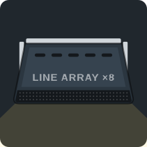
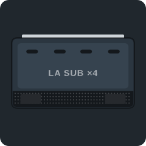
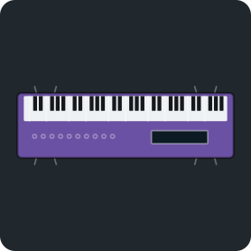
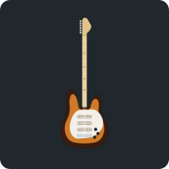
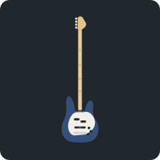
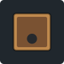
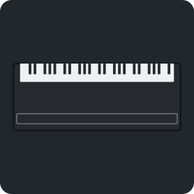
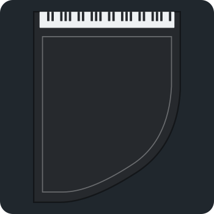
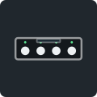
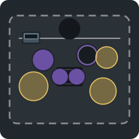

# Stage-plot symbols

Top-down symbols used on the Stageplot plot, drawn to real size (feet internally, metres shown).
Downstage (toward the audience) is the bottom of each drawing. Regenerate with `node tools/export-symbols.mjs`.

| Symbol | Key | Item | Footprint |
|---|---|---|---|
|  | `vox_mic` | Vocal mic (wired) | 0.27 × 0.27 m |
|  | `vox_wl` | Vocal mic (wireless) | 0.27 × 0.27 m |
|  | `headset` | Headset (wireless) | 0.27 × 0.27 m |
|  | `inst_mic` | Instrument mic | 0.27 × 0.27 m |
|  | `di_mono` | Mono DI box | 0.24 × 0.18 m |
|  | `di_stereo` | Stereo DI box | 0.30 × 0.18 m |
|  | `wedge` | Wedge monitor | 0.61 × 0.43 m |
|  | `main_spk` | Main speaker (powered) | 0.61 × 0.61 m |
|  | `sub` | Subwoofer (powered) | 0.91 × 0.91 m |
|  | `la_main` | Line array hang | 1.10 × 0.55 m |
|  | `la_sub` | Line array sub (flown) | 1.28 × 0.73 m |
|  | `iem` | IEM pack | 0.18 × 0.18 m |
|  | `iem_rack` | IEM transmitter rack | 0.61 × 0.61 m |
|  | `stagebox` | Stage box / digital snake | 0.61 × 0.43 m |
|  | `foh` | FOH console | 1.83 × 0.91 m |
|  | `mon_desk` | Monitor console | 1.22 × 0.76 m |
|  | `drum_kit` | Drum kit | 1.98 × 1.68 m |
|  | `drum_shield` | Drum shield | 2.44 × 0.12 m |
|  | `gtr_amp` | Guitar amp (miked) | 0.61 × 0.30 m |
|  | `bass_amp` | Bass amp | 0.61 × 0.46 m |
|  | `midi_keys` | MIDI keyboard controller | 1.52 × 0.61 m |
|  | `keys` | Keyboard rig | 1.52 × 0.61 m |
|  | `multifx` | Multi-effects floor unit (Helix style) | 0.64 × 0.30 m |
|  | `ac_guitar` | Acoustic guitar (on stand) | 0.43 × 1.04 m |
|  | `el_guitar` | Electric guitar (on stand) | 0.37 × 0.98 m |
|  | `bass_guitar` | Bass guitar (on stand) | 0.37 × 1.19 m |
|  | `trumpet` | Trumpet | 0.24 × 0.52 m |
|  | `cajon` | Cajón | 0.34 × 0.34 m |
|  | `up_piano` | Upright piano | 1.52 × 0.61 m |
|  | `grand_piano` | Grand piano | 1.52 × 1.98 m |
|  | `ipad_stand` | iPad stand | 0.30 × 0.24 m |
|  | `ac_preamp` | Acoustic preamp pedal | 0.24 × 0.17 m |
|  | `midi_fs` | MIDI footswitch controller | 0.52 × 0.17 m |
|  | `usb_if` | USB audio interface (2 in / 2 out) | 0.23 × 0.17 m |
|  | `mt_ipad` | MultiTracks iPad | 0.30 × 0.24 m |
|  | `edrums` | Electronic drum kit | 1.52 × 1.37 m |
|  | `pedalboard` | Pedalboard | 0.76 × 0.37 m |
|  | `laptop` | Tracks laptop | 0.61 × 0.46 m |
|  | `music_stand` | Music stand | 0.46 × 0.24 m |
|  | `pulpit` | Pulpit | 0.76 × 0.61 m |
|  | `riser` | Riser 2.4 × 2.4 m | 2.44 × 2.44 m |
|  | `drum_riser` | Drum riser | 2.44 × 2.44 m |
|  | `distro` | Power distro | 0.61 × 0.46 m |
|  | `pboard2` | Extension lead (2-way) | 0.27 × 0.14 m |
|  | `pboard4` | Extension lead (4-way) | 0.43 × 0.14 m |
|  | `pboard6` | Extension lead (6-way) | 0.58 × 0.14 m |
|  | `wall_outlet` | Power point (wall / floor) | 0.21 × 0.15 m |
|  | `camera` | Camera on tripod | 0.61 × 0.61 m |
|  | `conf_mon` | Confidence monitor | 1.07 × 0.30 m |
|  | `light_stand` | Light on stand | 0.46 × 0.46 m |
