# Stage-plot symbols

Top-down symbols used on the Stageplot plot, drawn to real size (feet internally, metres shown).
Downstage (toward the audience) is the bottom of each drawing. Regenerate with `node tools/export-symbols.mjs`.

| Symbol | Key | Item | Footprint |
|---|---|---|---|
|  | `vox_mic` | Vocal mic (wired) | 0.27 × 0.27 m |
|  | `vox_wl` | Vocal mic (wireless) | 0.27 × 0.27 m |
|  | `headset` | Headset (wireless) | 0.27 × 0.27 m |
|  | `inst_mic` | Instrument mic | 0.27 × 0.27 m |
|  | `di_mono` | DI box (mono) | 0.24 × 0.18 m |
|  | `di_stereo` | DI box (stereo) | 0.30 × 0.18 m |
|  | `wedge` | Wedge monitor | 0.61 × 0.43 m |
| 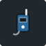 | `iem` | IEM pack | 0.18 × 0.18 m |
|  | `iem_rack` | IEM transmitter rack | 0.61 × 0.61 m |
| 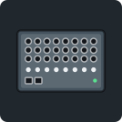 | `stagebox` | Stage box / digital snake | 0.61 × 0.43 m |
| 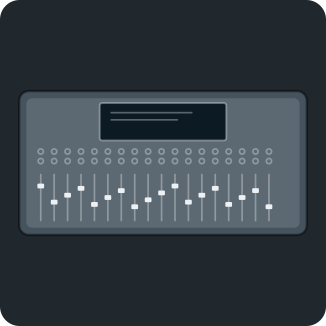 | `foh` | FOH console | 1.83 × 0.91 m |
| 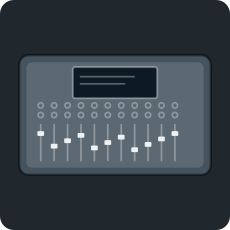 | `mon_desk` | Monitor console | 1.22 × 0.76 m |
|  | `main_spk` | Main speaker (powered) | 0.61 × 0.61 m |
| 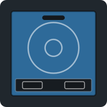 | `sub` | Subwoofer (powered) | 0.91 × 0.91 m |
| 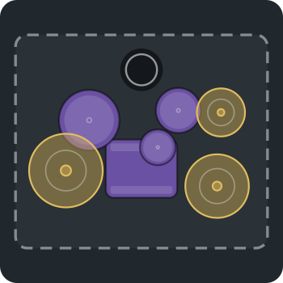 | `drum_kit` | Drum kit | 1.98 × 1.68 m |
| 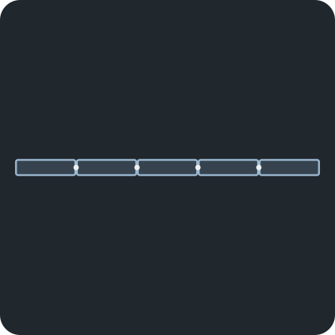 | `drum_shield` | Drum shield | 2.44 × 0.12 m |
|  | `gtr_amp` | Guitar amp (miked) | 0.61 × 0.30 m |
|  | `bass_amp` | Bass amp | 0.61 × 0.46 m |
|  | `keys` | Keyboard rig | 1.52 × 0.61 m |
|  | `pedalboard` | Pedalboard | 0.76 × 0.37 m |
|  | `laptop` | Tracks laptop | 0.61 × 0.46 m |
|  | `music_stand` | Music stand | 0.46 × 0.24 m |
|  | `pulpit` | Pulpit | 0.76 × 0.61 m |
| 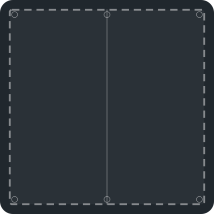 | `riser` | Riser 2.4 × 2.4 m | 2.44 × 2.44 m |
|  | `drum_riser` | Drum riser | 2.44 × 2.44 m |
| 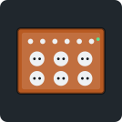 | `distro` | Power distro | 0.61 × 0.46 m |
|  | `pboard2` | Extension lead (2-way) | 0.27 × 0.14 m |
|  | `pboard4` | Extension lead (4-way) | 0.43 × 0.14 m |
| 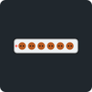 | `pboard6` | Extension lead (6-way) | 0.58 × 0.14 m |
|  | `wall_outlet` | Power point (wall / floor) | 0.21 × 0.15 m |
|  | `camera` | Camera on tripod | 0.61 × 0.61 m |
| 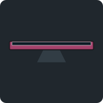 | `conf_mon` | Confidence monitor | 1.07 × 0.30 m |
| 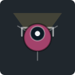 | `light_stand` | Light on stand | 0.46 × 0.46 m |
